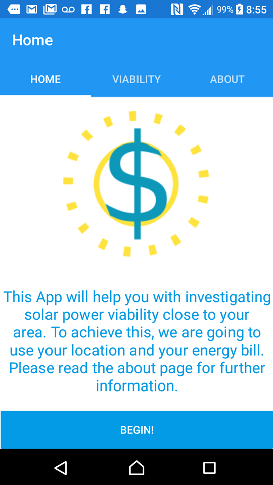
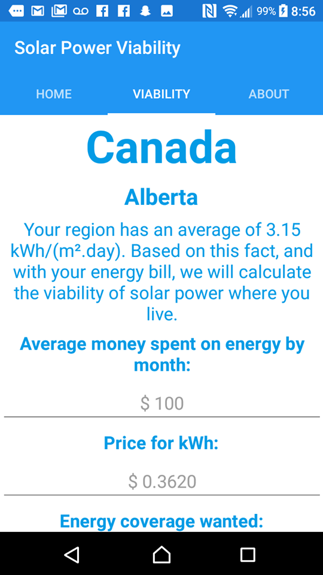
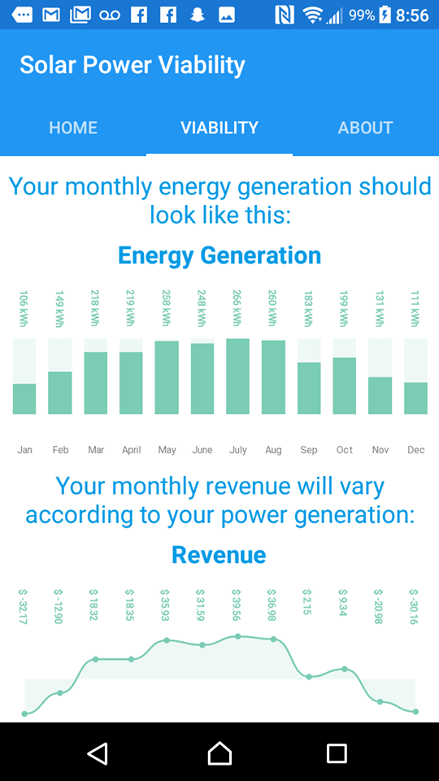
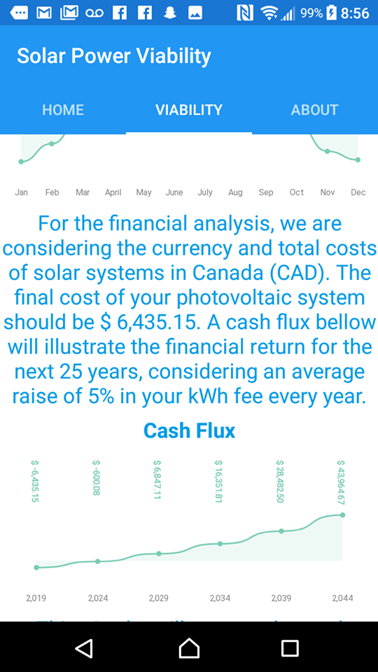
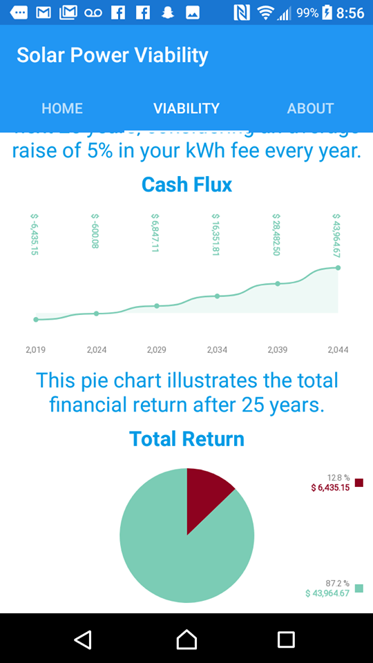

<h1>SolarVi</h1>

An app to estimate the viability of solar powering in the user's current location. It uses one of NASA's API to look for 
the local irradiance, then it estimates the best angle for a solar panel based on the user's latitude. With that information and the amount 
of money the user wants to save it is possible to estimate the viability of acquiring solar panels

